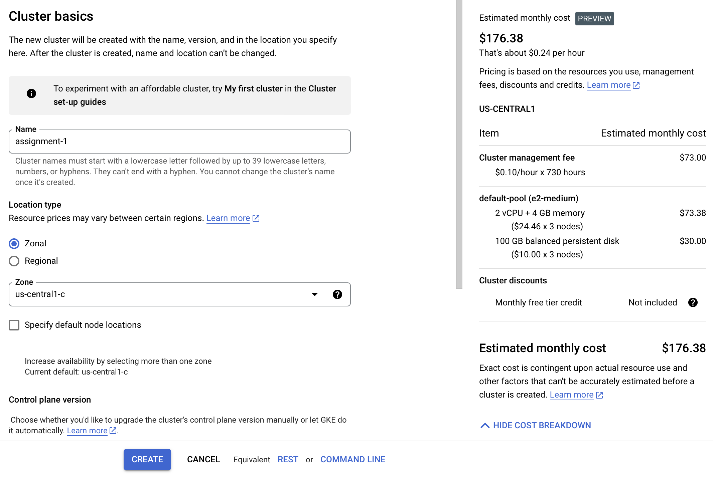
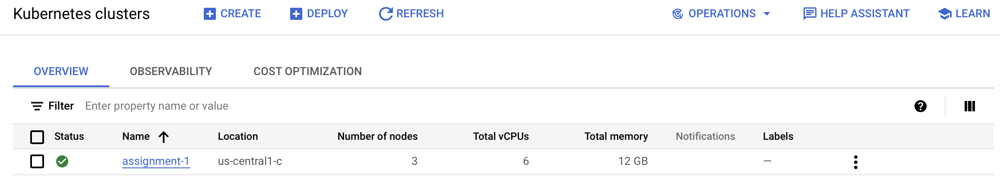
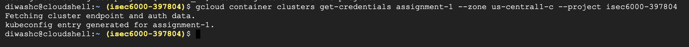
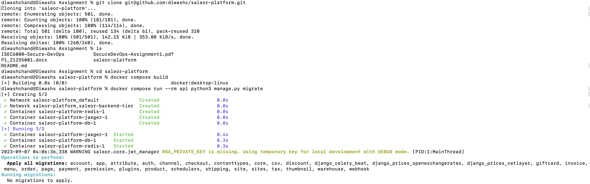
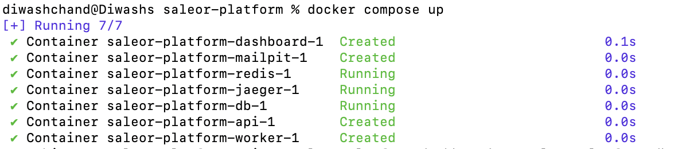
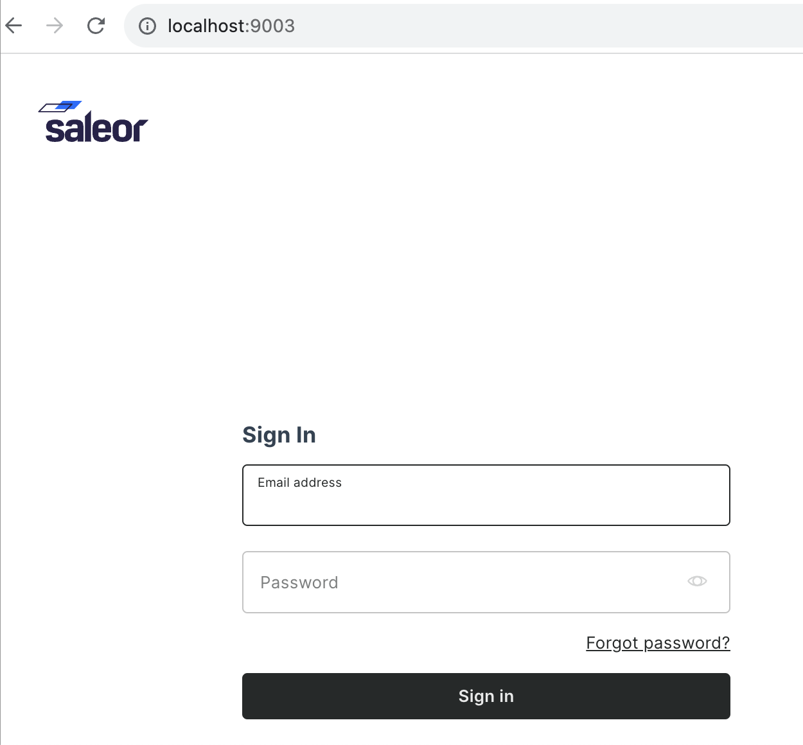
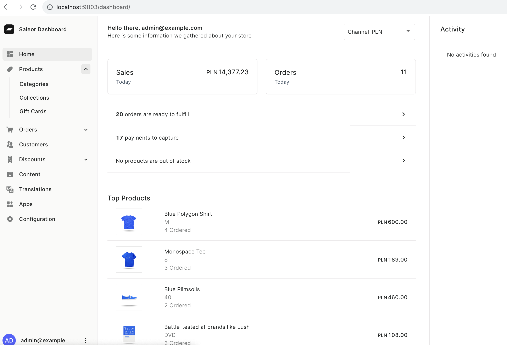

# ISEC6000-Secure-DevOps
**Git Links For Forked Repositories(TASK 2):**

Saleor Platform: https://github.com/diwashc/saleor-platform

React Storefront: https://github.com/diwashc/react-storefront
Google cloud and Microservice Architecture

Prerequisites: Google cloud login credentials, Docker, GIT

##Task 1

Created isec6000 project and cluster assignment1 for the project with location and node pool.
Authenticated kubectl with assignment1 cluster
The step by step output is shown below:

**Step 1:**

At first login in google cloud console is required. 

Then navigating inside Kubernetes Engine section using the GUI after clicking “Create Cluster” a new cluster is created as shown in figure below.

Then as shown in figure below we can see the cluster name, location, number of nodes, total CPU and total memory of the cluster that is created.

**Step 2:**

To configure the local environment to use kubectl to interact with the cluster we use the command “gcloud container clusters get-credentials CLUSTERNAME –zone us-central1-c –project PROJECT NAME”. As shown in figure below kubeconfig entry was generated for assignment-1.

## Task 2:

Step 1:

Fork https://github.com/saleor/saleor-platform into your personel github account. Clone the forked repository and change the port address to 9003 of dashboard from docker-compose.yml

git clone YOUR REPOSITORY LINK

Step 2:

Goto the cloned directory and build the application

cd saleor-platform

docker compose build

Step 3:

Apply Django Migrations 

docker compose run --rm api python3 manage.py migrate

Step 4:

Populate the database using example data

docker compose run --rm api python3 manage.py populatedb --createsuperuser

Step 5:

Run the application

docker compose up

The usage of the above steps are displayed below:

The URL for the dashboard displays the following output:

After using username admin@example.com and password admin the following page is displayed.

Now for react storefront

Step 1:

Fork https://github.com/saleor/react-storefront into your repository.

git clone YOUR REPOSITORY LINK

Goto the cloned directory and build the application

and change the port address from 3000 to 3009 of storefront from docker-compose.yml

Step 2:

Install pnpm globally

npm install -g pnpm

Step 4:

Install the Dependencies

pnpm i

Step 5:

Start the server

pnpm dev

The final step boots up 4 application runing on different ports

apps/react-storefront: http://localhost:3009
apps/saleor-app-checkout: http://localhost:3001
packages/checkout-storefront: http://localhost:3002
packages/ui-kit storybook: http://localhost:6006
